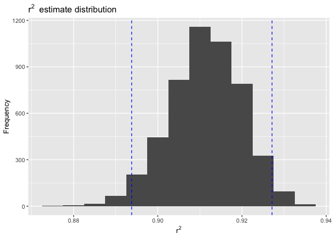
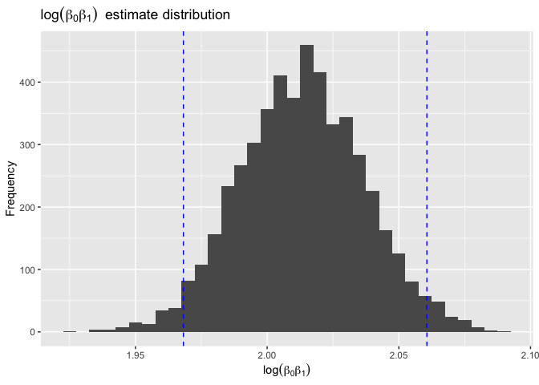
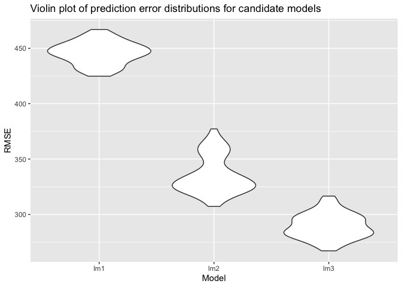

Homework 6
================
Zeqi Li
2024-12-02

# Problem 1

## Import weather data

``` r
weather_df = 
  rnoaa::meteo_pull_monitors(
    c("USW00094728"),
    var = c("PRCP", "TMIN", "TMAX"), 
    date_min = "2017-01-01",
    date_max = "2017-12-31") |> 
  mutate(
    name = recode(id, USW00094728 = "CentralPark_NY"),
    tmin = tmin / 10,
    tmax = tmax / 10) |> 
  select(name, id, everything())
```

## Perform bootstrapping

``` r
bootstrap = function(df) {
  sample_frac(df, replace = TRUE) 
}

boot_samp = tibble(n = 1:5000) |> 
  mutate(strap_samp = map(n, \(i) bootstrap(df = weather_df)))
```

## Build a simple linear regression model

``` r
boot_slr = boot_samp |> 
  mutate(models = map(strap_samp, \(df) lm(tmax ~ tmin, data = df))) |> 
  select(-strap_samp)
```

## Extract $r^2$ and $log(\hat{\beta_{0}} * \hat{\beta_{1}})$ estimates

``` r
boot_res = boot_slr |> 
  mutate(tidy_res = map(models, broom::tidy),
         glance_res = map(models, broom::glance)) |> 
  select(-models) |> 
  unnest(cols = c(tidy_res, glance_res),
         names_sep = "_")

est_df = boot_res |> 
  select(n, 
         tidy_res_term,
         tidy_res_estimate,
         glance_res_r.squared) |> 
  group_by(tidy_res_term) |> 
  pivot_wider(names_from = tidy_res_term,
              values_from = tidy_res_estimate) |> 
  rename(r_sq = glance_res_r.squared,
         beta_0 = `(Intercept)`,
         beta_1 = tmin) |> 
  mutate(log_betas = log(beta_0 * beta_1)) |> 
  select(-beta_0, -beta_1)
```

## Compute confidence intervals using all bootstrap samples

``` r
ci_df = est_df |> 
  summarize(r_sq_lb = quantile(r_sq, 0.025),
            r_sq_ub = quantile(r_sq, 0.975),
            log_betas_lb = quantile(log_betas, 0.025),
            log_betas_ub = quantile(log_betas, 0.975))
```

## Plot estimates with confidence intervals

### Histogram for $r^2$

``` r
est_df |> 
  ggplot(aes(x = r_sq)) +
  geom_histogram(binwidth = 0.005) +
  geom_vline(aes(xintercept = ci_df$r_sq_lb), 
             color = "blue", 
             linetype = "dashed") +
  geom_vline(aes(xintercept = ci_df$r_sq_ub), 
             color = "blue", 
             linetype = "dashed") +
  labs(title = expression(r^2 ~ " estimate distribution"),
       x = expression(r^2),
       y = "Frequency")
```

<!-- -->

The above is a histogram of the $r^{2}$ bootstrap distribution. $r^{2}$
quantifies the proportion of variability in the response variable,
`tmax`, that is explained by the predictor variable, `tmin`.

The blue dashed lines represent the lower and upper limits of the 95%
confidence interval for $r^{2}$. In this model, the confidence interval
is (0.894, 0.927), which means that the model explains 89.4% to 92.7% of
the variability in `tmax`.

Since the distribution is approximately bell-shaped and symmetric around
its center, the estimate of $r^{2}$ is robust across bootstrapped
samples, which means that the linear regression model consistently
explains a significant proportion of the variability in `tmax`.

### Histogram for $log(\hat{\beta_{0}} * \hat{\beta_{1}})$

``` r
est_df |> 
  ggplot(aes(x = log_betas)) +
  geom_histogram(binwidth = 0.005) +
  geom_vline(aes(xintercept = ci_df$log_betas_lb), 
             color = "blue", 
             linetype = "dashed") +
  geom_vline(aes(xintercept = ci_df$log_betas_ub), 
             color = "blue", 
             linetype = "dashed") +
  labs(title = expression(log(beta[0] * beta[1]) ~ " estimate distribution"),
       x = expression(log(beta[0] * beta[1])),
       y = "Frequency")
```

<!-- -->

The above is a histogram of the $log(\hat{\beta_{0}} * \hat{\beta_{1}})$
bootstrap distribution. $log(\hat{\beta_{0}} * \hat{\beta_{1}})$ is a
log-transformed product of the intercept, $\hat{\beta_{0}}$, and the
slope coefficient, $\hat{\beta_{0}}$, from the fitted linear regression
model.

The blue dashed lines represent the lower and upper limits of the 95%
confidence interval for $log(\hat{\beta_{0}} * \hat{\beta_{1}})$. In
this model, the confidence interval is (1.968, 2.061).

Since the distribution is approximately bell-shaped and symmetric around
the center, we can infer that the
$log(\hat{\beta_{0}} * \hat{\beta_{1}})$ is a robust metric derived from
the bootstrapping process for evaluating the linear regression model.

# Problem 2

## Import data from GitHub

``` r
url = "https://raw.githubusercontent.com/washingtonpost/data-homicides/master/homicide-data.csv"

homicide = read_csv(url(url),
                    na = c("", "Unknown"))
```

## Tidy up the `homicide` dataset

``` r
homicide_tidy = homicide |> 
  mutate(city_state = paste(city, 
                            state, 
                            sep = ", "),
         resolved = as.numeric(disposition == "Closed by arrest"),
         victim_age = as.numeric(victim_age),
         victim_race = fct_relevel(victim_race, "White")) |> 
  filter(!city_state %in% c("Dallas, TX", 
                            "Phoenix, AZ", 
                            "Kansas City, MO", 
                            "Tulsa, AL"),
         victim_race %in% c("White", "Black")) |> 
  select(-city & -state)
```

## Fit a logistic regression for Baltimore data

``` r
baltimore_df = homicide_tidy |> 
  filter(city_state == "Baltimore, MD")

baltimore_model = glm(resolved ~ victim_age + victim_sex + victim_race,
                      family = binomial(link = "logit"),
                      data = baltimore_df)
```

## Compute the adjusted odds ratio between sexes

``` r
baltimore_sum = baltimore_model |> 
  broom::tidy(conf.int = TRUE) |> 
  filter(term == "victim_sexMale") |> 
  mutate(estimate = exp(estimate),
         conf.low = exp(conf.low),
         conf.high = exp(conf.high)) |> 
  select(estimate, 
         conf.low,
         conf.high)

baltimore_sum |> 
  knitr::kable(digits = 3,
               caption = "Adjusted odds ratio and 95% confidence intervals for solving homicides between male and female victims in Baltimore, MD",
               col.names = c("Adjusted odds ratio",
                             "Confidence interval lower limit",
                             "Confidence interval upper limit"))
```

| Adjusted odds ratio | Confidence interval lower limit | Confidence interval upper limit |
|--------------------:|--------------------------------:|--------------------------------:|
|               0.426 |                           0.324 |                           0.558 |

Adjusted odds ratio and 95% confidence intervals for solving homicides
between male and female victims in Baltimore, MD

## Fit a logistic regression for all cities

``` r
all_model = homicide_tidy |> 
  group_by(city_state) |> 
  nest() |> 
  mutate(model = map(data, ~glm(resolved ~ victim_age + victim_sex + victim_race, 
                                family = binomial(link = "logit"), 
                                data = .x)),
         summary = map(model, ~broom::tidy(.x, 
                                           conf.int = TRUE))) |> 
  unnest(summary) |> 
  filter(term == "victim_sexMale") |> 
  mutate(estimate = exp(estimate),
         conf.low = exp(conf.low),
         conf.high = exp(conf.high)) |> 
  select(city_state,
         estimate,
         conf.low,
         conf.high)
```

## Plot adjusted odds ratios across all cities

``` r
all_model |> 
  arrange(estimate) |> 
  ggplot(aes(x = reorder(city_state, estimate),
             y = estimate)) +
  geom_point() +
  geom_errorbar(aes(ymin = conf.low,
                    ymax = conf.high)) +
  labs(title = "Adjusted odds ratios of solved homicides between sexes",
       x = "City",
       y = "Adjusted odds ratio") +
  theme(axis.text.x = element_text(angle = 90,
                                   vjust = 0.5,
                                   hjust = 1))
```

<!-- -->

The above plot shows the adjusted odds ratios of resolved homicide cases
between male and female victims for all cities in the `homicide_tidy`
dataset. The odds ratio in this case quantifies the odds of resolving
homicides for male victims compared to female victims while adjusting
for other factors in the model.

For cities whose confidence interval is below 1, such as New York NY,
Columbus OH, and Houston TX, there is a greater odds of resolving
homicides for male victims than female victims. Some cities, such as San
Bernardino CA, San Francisco CA, Boston MA, and those after Memphis TN,
have a 95% confidence interval that includes 1. This indicates that the
odds of resolving homicides is not statistically significant for male
and female victims in those cities. There aren’t any cities with a
confidence interval above 1, which means that in the dataset we’re
analyzing, there is no city where there is a lesser odds of resolving
homicides for male victims than female victims.

# Problem 3

## Import data

``` r
bwt_df = read_csv("data/birthweight.csv") |> 
  janitor::clean_names() |> 
  mutate(babysex = case_match(babysex,
                              1 ~ "male",
                              2 ~ "female"),
         babysex = fct_infreq(babysex),
         frace = case_match(frace,
                            1 ~ "white",
                            2 ~ "black",
                            3 ~ "asian",
                            4 ~ "puerto rican",
                            8 ~ "other",
                            9 ~ NA),
         frace = fct_infreq(frace),
         mrace = case_match(mrace,
                            1 ~ "white",
                            2 ~ "black",
                            3 ~ "asian",
                            4 ~ "puerto rican",
                            8 ~ "other"),
         mrace = fct_infreq(mrace),
         malform = case_match(malform,
                              0 ~ "absent",
                              1 ~ "present"),
         malform = fct_infreq(malform))
```

## Building a model for birthweight

Based on prior knowledge about physiological factors that would
influence infants’ birth weight, I decided to fit.a multiple linear
regression, using `bwt` as response and `delwt`, `gaweeks`, `malform`,
`smoken`, and `wtgain` as the predictors. I hypothesize that `delwt`,
`gaweeks`, and `wtgain` would positively influence `bwt`, while
`malform` and `smoken` would negatively inflience `bwt`.

``` r
bwt_lm1 = lm(bwt ~ delwt + gaweeks + malform + smoken + wtgain,
             data = bwt_df)

bwt_lm1 |> 
  broom::tidy() |> 
  select(term, estimate, p.value) |> 
  knitr::kable(digits = 3,
               capption = "Summary of proposed linear regression model",
               col.names = c("Term",
                             "Estimate",
                             "P-value"))
```

| Term           | Estimate | P-value |
|:---------------|---------:|--------:|
| (Intercept)    |  -39.296 |    0.67 |
| delwt          |    4.605 |    0.00 |
| gaweeks        |   60.854 |    0.00 |
| malformpresent |    7.277 |    0.95 |
| smoken         |   -7.045 |    0.00 |
| wtgain         |    5.130 |    0.00 |

## Plot model residuals of the proposed model

``` r
bwt_df |> 
  add_residuals(bwt_lm1) |> 
  add_predictions(bwt_lm1) |> 
  ggplot(aes(x = pred,
             y = resid)) +
  geom_point(alpha = 0.5) + 
  geom_hline(yintercept = 0,
             color = "blue",
             linetype = "dashed") + 
  labs(title = "Residual plot of proposed multiple linear regression model on birthweight",
       x = "Prediction",
       y = "Residual")
```

<!-- --> From
the residual plot above, we can see that the points are roughly
symmetrical around the `residual=0` line and randomly scattered without
a particular pattern. Therefore, we can conclude that the proposed
linear model is appropriate for predicting `bwt`.

## Compare proposed model to other models

### Split into training and testing datasets

``` r
cv_df = crossv_mc(bwt_df, 100) |> 
  mutate(train = map(train, as_tibble),
         test = map(test, as_tibble))
```

### Build models

``` r
cv_df = cv_df |> 
  mutate(lm1 = map(train, 
                   \(df) lm(bwt ~ delwt + gaweeks + malform + smoken + wtgain,
                            data = df)),
         lm2 = map(train, 
                   \(df) lm(bwt ~ blength + gaweeks,
                            data = df)),
         lm3 = map(train, 
                   \(df) lm(bwt ~ bhead*blength + bhead*babysex + blength*babysex + bhead*blength*babysex,
                            data = df)))
```

### Compute prediction errors

``` r
cv_df = cv_df |> 
  mutate(rmse_lm1 = map2_dbl(lm1, 
                             test,
                             \(mod, df) rmse(model = mod,
                                             data = df)),
         rmse_lm2 = map2_dbl(lm2, 
                             test,
                             \(mod, df) rmse(model = mod,
                                             data = df)),
         rmse_lm3 = map2_dbl(lm3, 
                             test,
                             \(mod, df) rmse(model = mod,
                                             data = df))) |> 
  select(starts_with("rmse")) |> 
  pivot_longer(everything(),
               names_to = "model",
               values_to = "rmse",
               names_prefix = "rmse_") |> 
  mutate(model = fct_inorder(model))
```

### Plot prediction errors

``` r
cv_df |> 
  ggplot(aes(x = model,
             y = rmse)) +
  geom_violin() +
  labs(title = "Violin plot of prediction error distributions for candidate models",
       x = "Model",
       y = "RMSE")
```

<!-- -->

`lm1` refers to the proposed linear regression model. `lm2` refers to
the linear regression model with `blength` and `gaweeks` as predictors.
`lm3` refers to the linear regression model with `bhead`, `blength`, and
`babysex` as predictors as well as their interactions.

From the violin plot, we observed that the proposed model has the
highest prediction errors, which indicates that it is not as reliable as
the other two. Overall, `lm3`, which accounted for the interactions
between predictors had the lowest prediction error abd performed the
best.
